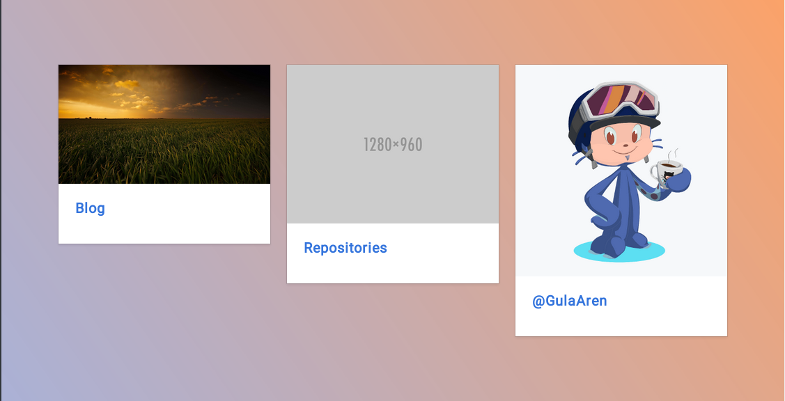

# [Tarbulma Jekyll Theme](#)

## Usage

```bash
$ git clone
$ cd
$ gem install jekyll jekyll-paginate
$ jekyll serve
```

Optional
```bash
$ rm -rf screenshots
$ rm README.md
```


### Example 

 - [GulaAren.github.io](https://gulaaren.github.io)

## Screenshots




## License

Open sourced under the [MIT license](LICENSE).
